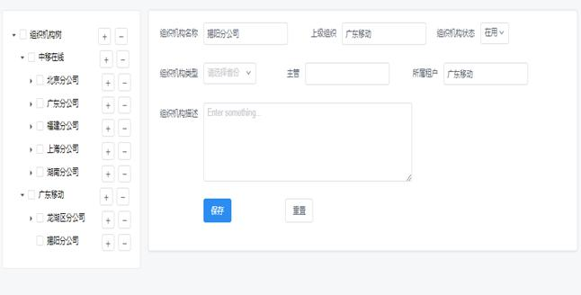

<<<<<<< HEAD
# iview-springboot
本项目是一个人员后台管理系统（含单点登陆功能简单实现）
=======
# iview-admin-OrgManage
在iview-admin的基础上开发了组织管理、人员管理、菜单管理、角色管理、单点登陆的功能
>>>>>>> e3c5a7fd211180372fd961ace1ca87f943540b26

#基本功能
实现了组织管理、人员管理、菜单管理、角色管理、单点登陆的功能

#开发实现
本项目基于github上两个项目进行开发
一个使用vue/iview的前端项目：iview-admim（本项目的前端代码基础）
一个使用springboot的全栈项目：bootdo（本项目服务端代码基础）

#界面截图
1、组织管理模块
