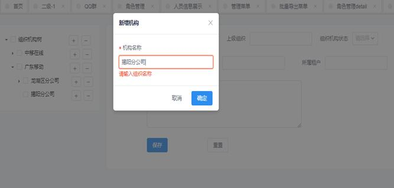
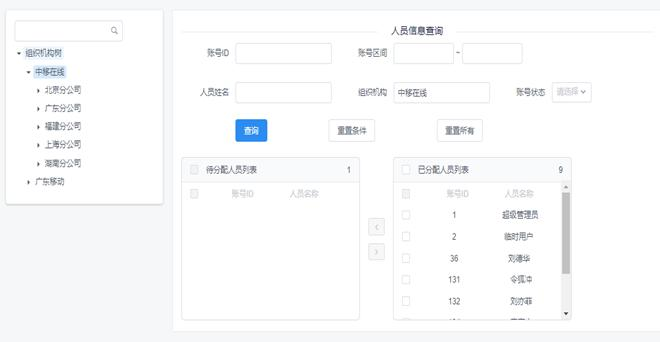
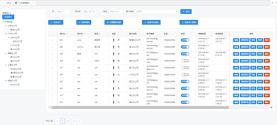
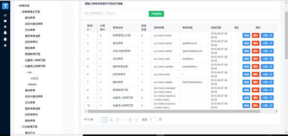
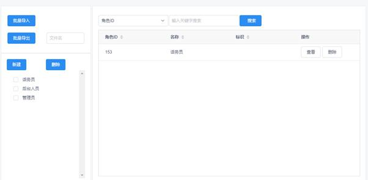
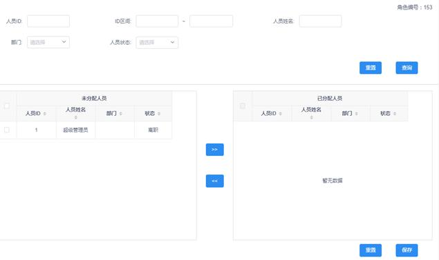
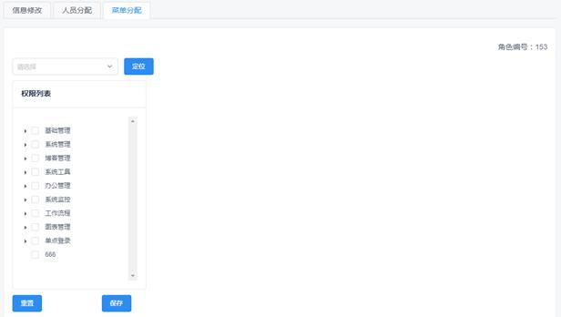

# iview-springboot
本项目是一个人员后台管理系统（含单点登陆功能简单实现）

#基本功能
======
实现了组织管理、人员管理、菜单管理、角色管理、单点登陆的功能

#开发实现
======
本项目基于github上两个项目进行开发
一个使用vue/iview的前端项目：iview-admim（本项目的前端代码基础）
一个使用springboot的全栈项目：bootdo（本项目服务端代码基础）

#界面截图
======
1、组织管理模块
======

人员分配页面

2、人员管理模块
======

3、菜单管理模块

4、角色管理模块

角色信息修改

角色分配人员

角色分配菜单

